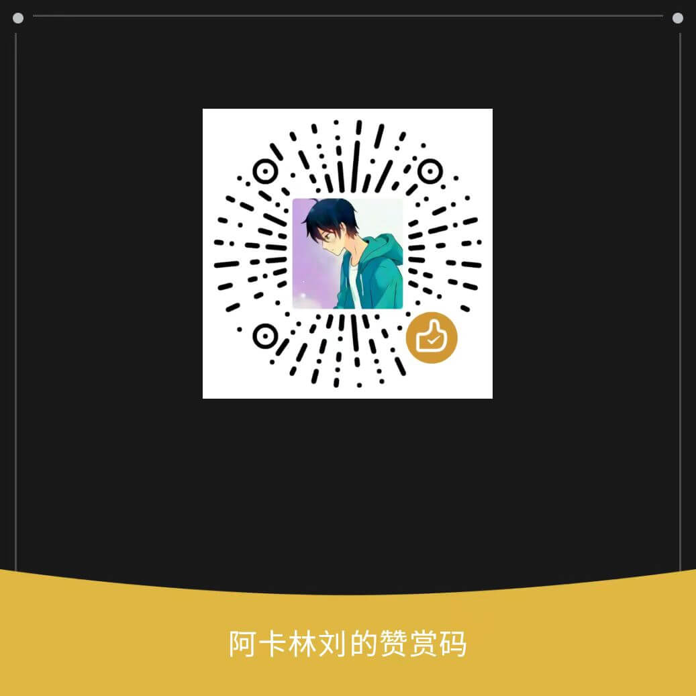

## 我的博客

## 进行的项目 
[LEDE](https://github.com/AkarinLiu/lede.git)
[OpenWRT](https://github.com/AkarinLiu/openwrt.git)
<!---
AkarinLiu/AkarinLiu is a ✨ special ✨ repository because its `README.md` (this file) appears on your GitHub profile.
You can click the Preview link to take a look at your changes.
--->
## 汇总

## 资助我

